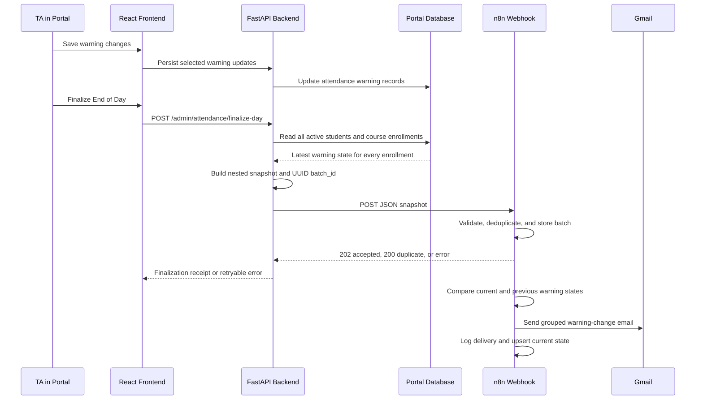
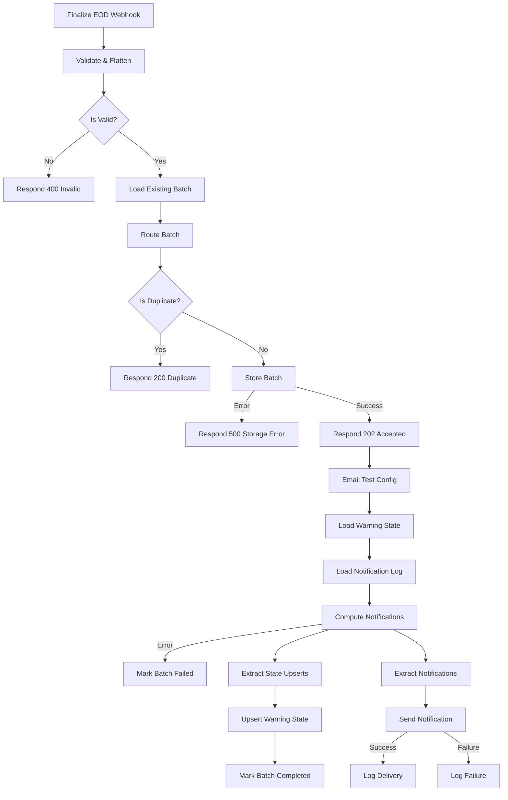

# n8n Attendance Warning Notification Workflow

## 1. Purpose

This workflow receives a finalized attendance-warning snapshot from the University Portal, validates and stores it, compares it with the previous saved warning state, and sends one notification when a student's course warning level changes.

There is no Day 2 process. The current workflow performs one comparison and one notification cycle for each finalized snapshot.

Warning levels:

| Level | Meaning | Email treatment |
| --- | --- | --- |
| 0 | Good | Normal update when a warning is cleared. |
| 1 | Warning 1 | Standard warning update. |
| 2 | Warning 2 | Standard warning update with orange course styling. |
| 3 | Drop | Urgent red course-drop email requiring immediate attention. |

## 2. How data reaches n8n

The browser does not call n8n directly. The portal backend builds and sends the authoritative snapshot.



### 2.1 Frontend action

The Attendance Warning Review section calls:

```http
POST /admin/attendance/finalize-day
```

If the selected student has unsaved changes, the UI first asks the TA to **Save and Finalize**. The warning changes are persisted before the snapshot is built.

### 2.2 Backend snapshot construction

`app/services/n8n_attendance.py` creates a fresh UUID batch ID and UTC finalization timestamp. It queries:

- Every active user with the student role.
- Every course enrollment for each selected student.
- The latest attendance record for each student-course enrollment.

If an enrollment has no attendance record, the backend sends warning level `0`.

The snapshot therefore includes Level 0, Level 1, Level 2, and Level 3 courses. Keeping Level 0 courses is necessary so n8n can detect when a warning returns to Good.

### 2.3 Server-to-server delivery

The FastAPI backend sends the snapshot to `N8N_ATTENDANCE_WEBHOOK_URL` using:

- HTTP method: `POST`
- Content type: `application/json`
- Timeout: 30 seconds
- Sender: portal backend, not the student's browser

The current portal implementation does not send an authentication header. Webhook authentication should be added before sending real student emails.

### 2.4 Portal handling of the n8n response

The portal treats any HTTP `2xx` response as accepted.

- Missing webhook configuration: portal returns HTTP 503.
- Timeout, connection problem, or n8n non-2xx response: portal returns HTTP 502.
- Success: the UI displays the batch ID, finalization time, student count, and course-record count.

Saved portal attendance data is not deleted or reset when n8n delivery fails.

## 3. Webhook request contract

### 3.1 URLs

- Test: `/webhook-test/attendance-end-of-day`
- Production: `/webhook/attendance-end-of-day`

The test URL works only while n8n is listening for a test event. The production URL requires the workflow to be published and active.

### 3.2 Example request

```json
{
  "batch_id": "73bcfa6a-04bf-4fce-821e-b9560d8f7d03",
  "finalized_at": "2026-07-25T20:15:00Z",
  "warning_level_labels": {
    "0": "Good",
    "1": "Warning 1",
    "2": "Warning 2",
    "3": "Drop"
  },
  "students": [
    {
      "student_id": "STU-2024-0003",
      "student_name": "Lakshy",
      "recipient": "student@example.com",
      "courses": [
        {
          "course_id": "CS-301",
          "course_name": "Database Systems",
          "warning_level": 3
        }
      ]
    }
  ]
}
```

### 3.3 Required fields

| Field | Type | Rules |
| --- | --- | --- |
| `batch_id` | String | Required UUID. Used for batch deduplication. |
| `finalized_at` | String | Required valid ISO-8601 timestamp. |
| `students` | Array | Required and non-empty. |
| `students[].student_id` | String | Required and non-empty. |
| `students[].courses` | Array | Required and non-empty. |
| `courses[].course_id` | String | Required and non-empty. |
| `courses[].warning_level` | Integer | Required; must be 0, 1, 2, or 3. Numeric strings are accepted. |

Optional display and delivery fields are `student_name`, `recipient`, and `course_name`.

The combination `student_id + course_id` must be unique within a batch.

## 4. HTTP responses

| Condition | Status | Meaning |
| --- | --- | --- |
| Invalid payload | 400 | Rejected; batch is not stored or processed. |
| Existing `batch_id` | 200 | Previously accepted duplicate; not processed again. |
| New batch stored | 202 | Accepted for asynchronous processing. |
| Batch storage failure | 500 | Not durably accepted. |

Example accepted response:

```json
{
  "accepted": true,
  "duplicate": false,
  "batch_id": "73bcfa6a-04bf-4fce-821e-b9560d8f7d03",
  "finalized_at": "2026-07-25T20:15:00Z",
  "students_processed": 15,
  "course_records_received": 80,
  "message": "Attendance snapshot accepted for processing."
}
```

HTTP 202 confirms that n8n stored the batch. It does not guarantee that Gmail delivery has already completed.

## 5. Simplified workflow



The Day 2 table load, Day 2 computation, pending-confirmation creation, and temporary logical-day override have been removed.

## 6. What each node does

The revised export contains 26 nodes: 23 executable nodes and 3 sticky notes.

| # | Node | Type | Responsibility |
| --- | --- | --- | --- |
| 1 | Finalize EOD Webhook | Webhook | Receives the portal's POST request at `attendance-end-of-day` and waits for a Respond to Webhook node. |
| 2 | Validate & Flatten | Code | Validates the entire payload and converts nested students/courses into one flat record per student-course pair. |
| 3 | Is Valid | IF | Routes valid requests to duplicate detection and invalid requests to HTTP 400. |
| 4 | Load Existing Batch | Data Table Get | Looks for the submitted `batch_id` in `attendance_finalize_batches`. |
| 5 | Route Batch | Code | Determines whether the batch already exists and prepares the 200 and 202 response bodies. |
| 6 | Is Duplicate | IF | Routes an existing batch to HTTP 200 or a new batch to durable storage. |
| 7 | Respond 200 Duplicate | Respond to Webhook | Confirms that the batch was already accepted and prevents duplicate processing. |
| 8 | Store Batch | Data Table Insert | Stores the batch as `processing`, including timestamps, counts, and serialized payload. |
| 9 | Respond 202 Accepted | Respond to Webhook | Acknowledges a newly stored batch, then permits asynchronous processing to continue. |
| 10 | Email Test Config | Set | Holds `test_mode` and `test_recipient`. When enabled, every email goes to the controlled test address. |
| 11 | Load Warning State | Data Table Get | Loads the previous warning baseline from `student_course_warning_state`. |
| 12 | Load Notification Log | Data Table Get | Loads past delivery keys from `attendance_notification_log` for idempotency. |
| 13 | Compute Notifications | Code | Compares current and previous warning states, groups changes per student, creates normal or Level 3 HTML emails, and produces state upserts. |
| 14 | Extract State Upserts | Code | Converts the `stateUpserts` array into individual n8n items. |
| 15 | Upsert Warning State | Data Table Upsert | Inserts or updates the current warning baseline by `state_key`. |
| 16 | Mark Batch Completed | Data Table Update | Changes the accepted batch status to `completed` after state upserts. It preserves the original counts. |
| 17 | Extract Notifications | Code | Converts the `notifications` array into one item per student notification. |
| 18 | Send Notification | Gmail | Sends an HTML email, using the test recipient override when test mode is enabled. |
| 19 | Log Delivery | Data Table Insert | Logs a successful delivery with the notification's idempotency key and type. |
| 20 | Respond 500 Storage Error | Respond to Webhook | Returns HTTP 500 when Store Batch fails. |
| 21 | Mark Batch Failed | Data Table Update | Marks the stored batch failed if Compute Notifications throws an error. It preserves the original counts. |
| 22 | Log Failure | Data Table Insert | Records a failed Gmail attempt and its notification metadata. |
| 23 | Respond 400 Invalid | Respond to Webhook | Returns the validation error with HTTP 400. |
| 24 | Overview | Sticky Note | Documents the workflow's purpose. It has no runtime effect. |
| 25 | Responses | Sticky Note | Documents response behavior. It has no runtime effect. |
| 26 | First Run | Sticky Note | Documents baseline behavior. It has no runtime effect. |

## 7. Validate & Flatten

The node supports both webhook shapes:

```js
const req = $input.first().json;
const body = req.body && typeof req.body === 'object'
  ? req.body
  : req;
```

It stops on the first error and returns:

- `valid`
- `error`
- `batch_id`
- `finalized_at`
- `received_at` in Africa/Cairo
- `students_count`
- `course_records_count`
- Flat `records`
- Serialized `payload_json`
- Prepared `invalidResponse`

Each flattened record uses this stable comparison key:

```text
state_key = student_id + ":" + course_id
```

## 8. Compute Notifications

### 8.1 First run

If `student_course_warning_state` is empty, the workflow stores the submitted state but sends no notifications. This prevents all existing warnings from looking newly created during initial setup.

### 8.2 Change detection

| Previous | Current | Result |
| --- | --- | --- |
| No record | Level 0 | Store baseline; no email. |
| No record | Level 1, 2, or 3 | Send notification. |
| Same level | Same level | No email. |
| Any level | Different level | Send notification. |
| Tracked course | Missing course | Report `No longer enrolled` when current student recipient data is available. |

All changes for the same student are grouped into one email.

### 8.3 Idempotency

The workflow creates a delivery key from:

```text
student_id + date + notification_type + hash(changes_json)
```

Only log rows with `status = sent` are treated as successfully delivered keys by Compute Notifications.

Batch-level duplicate protection remains separate and uses `batch_id`.

### 8.4 State update

The node always generates a complete `stateUpserts` list containing Level 0 through Level 3. After the upsert branch completes, the current snapshot becomes the comparison baseline for the next finalization.

## 9. Email design

### 9.1 Standard warning-change email

If no course changes to Level 3, the email uses:

- Subject: `Attendance Warning Level Update`
- Blue header
- A colored card for each changed course
- Yellow styling for Level 1
- Orange styling for Level 2
- Green styling when a warning returns to Good
- A request to review the portal and contact the TA if incorrect

### 9.2 Level 3 Drop email

If any changed course has `new_level = 3`, the entire grouped email becomes urgent:

- Subject: `URGENT: Course Drop Notice`
- Dark-red header
- `IMMEDIATE ATTENTION IS REQUIRED` messaging
- Red Level 3 course card
- `LEVEL 3 — DROP` badge
- Strong explanation that the student has been marked as dropped
- Instruction to review the portal and immediately contact the TA or academic administration if incorrect
- Notification type: `WARNING_LEVEL_3_DROP`

If the same email contains other changed courses, they remain listed, but the presence of any new Level 3 change makes the overall email urgent.

### 9.3 Test mode

When `test_mode = true`, Gmail sends to `test_recipient` instead of the student. A visible test-mode banner shows the original intended recipient.

Keep test mode enabled until the HTML email has been verified in Gmail on desktop and mobile.

## 10. Data tables

### 10.1 `attendance_finalize_batches`

Durably stores accepted webhook batches and prevents the same batch ID from being processed twice.

Important fields:

- `batch_id`
- `finalized_at`
- `received_at`
- `status`
- `students_count`
- `course_records_count`
- `payload_json`
- `error_message`

The revised completed and failed mappings preserve the original student/course counts instead of overwriting them with zero.

### 10.2 `student_course_warning_state`

Stores the latest baseline:

- `state_key`
- `student_id`
- `course_id`
- `course_name`
- `warning_level`
- `snapshot_date`
- `updated_at`

### 10.3 `attendance_notification_log`

Stores email attempts:

- `idempotency_key`
- `student_id`
- `notification_type`
- `status`
- `sent_at`

The former `pending_day2_confirmations` table is no longer read or written by this workflow. It may be archived or deleted later after confirming no other workflow uses it.

## 11. Failure handling

### Invalid request

- Return HTTP 400.
- Do not store the batch.
- Do not change warning state.
- Do not send email.

### Batch-storage failure

- Return HTTP 500.
- Do not return HTTP 202.
- The portal can safely retry.

### Compute failure

- Route the Code node error output to Mark Batch Failed.
- Store the technical error message.
- Preserve the original batch counts.

### Gmail failure

- Write a `failed` notification-log row.
- Do not write a successful delivery row.

### State-upsert failure

The current Upsert Warning State node has no explicit error branch. A failure stops that branch and can leave the batch in `processing`. Add an error route to Mark Batch Failed if this must be represented in the batch table.

## 12. Simplifications made

- Removed Load Pending Confirmations.
- Removed Create Pending Confirmation.
- Removed all Day 2 computation and fields.
- Removed `nextDay`, `day2`, `day2_key`, `confirmation_id`, and due-date logic.
- Removed the temporary 8:42 PM logical-day boundary found in the supplied export.
- Renamed Day 1-specific nodes to general notification names.
- Reduced the post-acceptance data loads from three tables to two.
- Reduced successful email side effects from two Data Table writes to one delivery-log write.
- Preserved validation, durable acceptance, batch deduplication, warning-state comparison, first-run protection, Gmail test mode, delivery logging, and state upserts.
- Fixed completed/failed batch mappings so they no longer reset counts to zero.

This reduces nodes and Data Table operations without changing how the portal sends snapshots or how warning differences are detected.

## 13. Testing checklist

### Import and setup

1. Import `Attendance Warning Notifications - Day 1 Only.json` into n8n.
2. Confirm the Gmail OAuth2 credential is attached to Send Notification.
3. Confirm Email Test Config has `test_mode = true` and the correct controlled recipient.
4. Save the workflow.
5. Use Listen for test event with the test webhook URL, or publish the workflow for the production URL.

### Functional tests

1. First snapshot: establishes the baseline and sends no email.
2. Level 0 to Level 1: standard email.
3. Level 1 to Level 2: standard email with orange course card.
4. Level 2 to Level 0: standard correction email with green course card.
5. Any level to Level 3: urgent red Drop email.
6. Re-submit the same batch ID: HTTP 200 duplicate and no second email.
7. Invalid warning level: HTTP 400.
8. Gmail failure: Log Failure receives the notification item.
9. Confirm stored batch counts remain unchanged after completion.

## 14. Production considerations

- Add webhook authentication before setting `test_mode = false`.
- Protect `payload_json`; it contains student names and email addresses.
- Decide whether `completed` means state processing completed or all email delivery attempts completed. The current batch-completion branch follows state upserts and does not wait for Gmail.
- A failed Gmail send is logged, but the state baseline may still advance in parallel. If guaranteed email retry is required, add a dedicated notification outbox/retry design rather than relying only on the warning-state comparison.
- A stored failed batch is still detected as a duplicate if the same batch ID is retried. Define an explicit failed-batch replay policy if needed.

